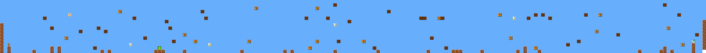
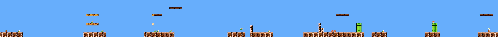
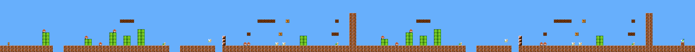
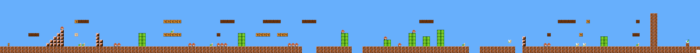
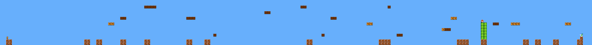
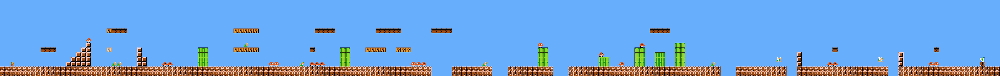
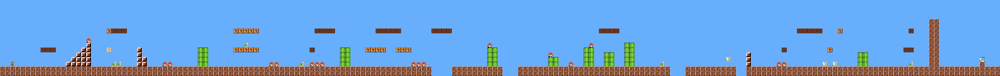
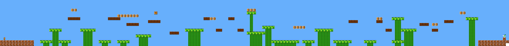
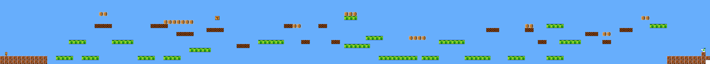

[](https://cog2026.org/)


# From Tiles to Jumps: WFC Window Size for Playable Platformer Generation

Generated and evaluated **153,000 Super Mario Bros. levels** to identify which Wave Function Collapse window sizes produce playable platformer content. Playability plateaued once the window spanned Mario's jump height.

This repository contains the Java generator, A* evaluation pipeline, analysis code, generated-level examples, and experiments used in the paper by Trevor Truesdell and Britton Horn, Trinity University, **accepted for presentation at IEEE Conference on Games (CoG) 2026**.

Built on top of the [Mario AI Framework](https://github.com/amidos2006/Mario-AI-Framework) by Ahmed Khalifa.

## Project Highlights

- **Technical Work:** Implemented a configurable WFC generator, multi-source batch runner, output management, and Mario game-agent integration.
- **Experiment Scope:** Generated and evaluated **153,000 levels** across 9 window sizes and 17 source configurations.
- **Key Finding:** Agent completion increased from **32.0% at 2 x 2** to **99.9% at 6 x 6**, where playability plateaued.

The visual comparison below shows the progression from diverse but incoherent layouts to structured, playable output.

| 1 x 1: diverse, incoherent | 3 x 3: emerging structure | 6 x 6: structured, playable |
| --- | --- | --- |
|  |  |  |

At 3 x 3, recognizable ground segments and pipe fragments begin to appear, but gaps are still frequently unjumpable.

The project combines procedural generation, game-agent evaluation, statistical analysis, and human playtesting to connect those output differences to actual player experience.

---

## How WFC Works

WFC generates tile-based content by extracting patterns from an example and enforcing their adjacency rules. The **window size**, the M × N rectangle captured during pattern extraction, controls how much spatial context each pattern encodes. Small windows produce varied but incoherent output; large windows preserve structure but collapse toward reproducing the source.

This project measures that trade-off across agent completion, structural metrics, and human playtesting. Window size provides a physics-grounded control for how much structure the generator preserves.

---

## Visual Results

The examples below are generated from **Level 4** as the source. The comparison in Project Highlights shows the full 1x1 to 6x6 progression; these additional examples show the intermediate failure mode, the useful middle range, and the over-constrained large-window case.

### Source level



### 2 × 2: worst performer



Enough context to escape 1×1's density, not enough for deliberate structure. **32%** completion, the lowest of any window size.

### 4 × 4 to 5 × 5: the usable middle



Mid-size windows balance playability against diversity, reaching **68.6%** completion at 4 x 4 and **87.1%** at 5 x 5.

### 14 × 6: over-constrained



Full jump height *and* length. Also **99.9%** completion, but edit distance to the source drops to near zero, meaning the generator is essentially reproducing its input. Playable, but barely generative.

### Physics-oriented windows

Beyond the square progression, three windows test specific movement constraints:

| Window | Captures | Completion |
|---|---|---|
| 6 × 6 | Mario's jump height | 99.9% |
| 14 × 2 | Full jump length, minimal vertical context | 96.0% |
| 14 × 6 | Full jump length and height | 99.9% |

### Decoration removal (Level 13)

| Original | Supports removed |
|---|---|
|  |  |

Level 13's decorative mushroom supports sit directly on the traversal path. Removing them, the minimal structural intervention available, measurably changed output diversity and completion, suggesting purely aesthetic tiles still carry adjacency context that shapes pattern coherence.

---

## Research Results

Agent completion percentage by window size, averaged across all source levels:

| Window Size | Mean Completion | Variance |
|---|---|---|
| 1 × 1 | 0.756 | 0.141 |
| 2 × 2 | 0.320 | 0.110 |
| 3 × 3 | 0.558 | 0.161 |
| 4 × 4 | 0.686 | 0.130 |
| 5 × 5 | 0.871 | 0.074 |
| 6 × 6 | **0.999** | <0.001 |
| 1 × 16 | 0.879 | 0.077 |
| 14 × 2 | 0.960 | 0.024 |
| 14 × 6 | **0.999** | <0.001 |

A one-way ANOVA found window size significantly affects completion, F(8, 152991) = 11092.12, p < 0.001. Tukey's HSD found all pairwise comparisons significant at p < .001 except 5×5 vs 1×16 and 6×6 vs 14×6.

**Vertical context matters more than horizontal.** 14×2 captures full jump *length* but only 2 tiles of height, and reaches 96%. 6×6 captures jump *height* and reaches 99.9%. Gaps rarely span maximum jump distance, but vertical relationships are hard-constrained by fixed jump height.

**Human trials (n = 25).** Large-window levels were rated statistically indistinguishable from original Super Mario Bros. levels on playability, enjoyment, coherence, and replayability, differing only on challenge, where they scored lower. Agent completion was a strong predictor of human progress (rs = 0.582, p < .001), supporting A* screening as a cheap proxy before committing to playtesting.

---

## Implementation

The WFC implementation lives in [`src/levelGenerators/ttWFC/`](src/levelGenerators/ttWFC/), with [`OverlappingModel.java`](src/levelGenerators/ttWFC/OverlappingModel.java) as its core. It partitions each Mario level into non-overlapping M × N regions, identifies repeated tile regions, and learns their valid adjacencies and frequencies directly from the source levels.

For a quick code review, start with [`OverlappingModel.java`](src/levelGenerators/ttWFC/OverlappingModel.java), then follow the reusable generation API in [`LevelGenerator.java`](src/levelGenerators/ttWFC/LevelGenerator.java) and the batch orchestration in [`BatchRunner.java`](src/levelGenerators/ttWFC/BatchRunner.java).

This design makes window size the main experimental variable while preserving the structural relationships that make a Mario level playable. The implementation also supports pooled multi-level generation through the `"all"` source configuration.

Key implementation details:

- Levels are padded with `-` to a multiple of M horizontally and N vertically, then trimmed back on save (trailing all-hyphen columns are detected dynamically).
- The bitmap is stored bottom-row-first internally and flipped on write, so ground constraints read naturally.
- `symmetry = 1` throughout, meaning only the unrotated, unreflected variant of each pattern is kept. Rotation and reflection would flip staircases and place ground on ceilings.
- `periodicInput` and `periodic` are both false. Wrapping edges would let ground appear at arbitrary heights.

---

## WFC modifications

Several changes were needed on top of the stock bitmap-oriented algorithm:

- **Edge constraints:** `groundAllowed`, `topAllowed`, `leftAllowed`, and `rightAllowed` record which patterns were observed touching each boundary in the source. Patterns are restricted to the boundaries they legitimately occupied. Without this, edge tiles placed in the interior cause generation failures from missing adjacencies.
- **`"all"` multi-source mode:** reads all 15 originals from `samples/` and pools their tiles and adjacencies, letting patterns blend across levels with otherwise incompatible rules. Requires the similar-tiles reduction below.
- **Similar tiles:** enemy characters (`g G r R k K y Y o`) are stripped before comparison, and tiles identical under that reduction are grouped into equivalence classes that share adjacency. Without this, ambiguous enemy placement over-constrains generation. During generation any member of the class may be selected.
- **Mario and finish tile placement:** `M` and `F` carry singular adjacencies and drift to arbitrary x positions, sometimes putting the finish before the start or producing duplicates. Their cells are pre-observed at fixed output indices (`mPreobserveIndex`, `fPreobserveIndex`), derived from their position in the source and offset to the output dimensions.
- **Retry on contradiction:** generation that hits a contradiction is retried with a fresh seed rather than backtracked. Note that failure rates were not tracked, so the frequency of regeneration is unknown.

---

## Run It

The recommended entry point is [`src/levelGenerators/GenerateWFC.java`](src/levelGenerators/GenerateWFC.java). Edit its configuration constants before running it; there are no command-line arguments. `GenerateWFC` selects single-level or batch mode and delegates batch generation to `BatchRunner`. Run it from the repository root so relative paths resolve correctly. Source levels are read from `src/levelGenerators/ttWFC/samples/`, which mirrors `levels/original/` and adds `lvl-13-modified.txt`.

When using VS Code with the parent workspace open, select **Run GenerateWFC** from **Run and Debug**. Its launch configuration sets the working directory to `WaveFunctionCollapse_Mario-AI-Framework`; the regular **Run Java** button may use the parent folder instead.

`GenerateWFC` supports two modes:

```java
private static final Mode MODE = Mode.BATCH;
private static final OutputMode OUTPUT_MODE = OutputMode.WINDOW_FOLDERS;
private static final Path OUTPUT_ROOT = Paths.get("WFC_Output");
```

Use `Mode.SINGLE_LEVEL` for one output or `Mode.BATCH` for repeated generation. `OutputMode.WINDOW_FOLDERS` stores levels in folders such as `WFC_Output/1x1/` and `WFC_Output/2x2/`; `OutputMode.ONE_FOLDER` stores all generated files directly in `WFC_Output/`.

### A single level

Set `MODE` to `Mode.SINGLE_LEVEL`, then edit:

```java
private static final String SINGLE_LEVEL = "lvl-13";
private static final int SINGLE_M = 6;
private static final int SINGLE_N = 3;
```

Output width is taken from the source level and padded to a multiple of M; height is fixed at 16 and padded to a multiple of N. The generator retries with new seeds until one succeeds, then writes a file such as `WFC_Output/6x3/ttwfc-lvl-13-M6-N3-s12345.txt`.

`LevelGenerator` implements `MarioLevelGenerator` under the name `ttWFC`, so it also drops into the framework's standard pipeline via `GenerateLevel.java`:

```java
MarioLevelGenerator generator = new levelGenerators.ttWFC.LevelGenerator();
```

### A full sweep

Set `MODE` to `Mode.BATCH` and edit:

```java
private static final String[] BATCH_LEVELS = {"all"};
private static final int[][] BATCH_WINDOWS = {{1, 1}, {2, 2}};
private static final int BATCH_REPEATS = 1000;
private static final int BATCH_ATTEMPTS_PER_REPEAT = 10000;
```

Each `BATCH_WINDOWS` entry is an explicit `{M, N}` pair. For example, `{{1, 1}, {2, 2}}` generates only 1x1 and 2x2 windows. Add more entries to generate more window sizes, and add more names to `BATCH_LEVELS` to use specific source levels instead of `"all"`.

Output is written to files such as `WFC_Output/1x1/tmp-all-M1-N1-s12345.txt`. The batch runner does not create a CSV or evaluate levels; it only generates level files. Runs that exhaust `BATCH_ATTEMPTS_PER_REPEAT` log a warning and skip.

### Playing or evaluating a level

Run [`src/PlayLevel.java`](src/PlayLevel.java), which runs the `robinBaumgarten` A* agent on a given level:

```java
printResults(game.runGame(new agents.robinBaumgarten.Agent(), getLevel("levels/original/lvl-1.txt"), 20, 0, true));
```

Point `getLevel` at anything under `levels/` or at generated output in `WFC_Output/`. Uncomment the `playGame` line to play it yourself instead. The full A* suite used for the paper's playability numbers is in [`src/mff/`](src/mff/).

---

## Repository layout

```
img/                          Figures and window size examples
levels/
  original/                   The 15 original Super Mario Bros. levels
  waveFunctionCollapse/       Archived dataset, one folder per window size
    1x1/ 2x2/ 3x3/ 4x4/ 5x5/ 6x6/ 14x2/ 14x6/ 1x16/
  ge/ hopper/ notch/          Output from the framework's other generators
  notchParam/ notchParamRand/
  ore/ sampler/
  patternCount/               
  patternOccur/
  patternWeightCount/
src/
  levelGenerators/
    GenerateLevel.java
    GenerateWFC.java          Recommended WFC entry point
    PlayLevel.java
    ttWFC/                    Our WFC implementation
      OverlappingModel.java     Core algorithm
      Model.java                Base solver: wave, propagator, observe
      LevelGenerator.java       Single-level generation
      BatchRunner.java          Batch-generation engine used by GenerateWFC
      samples/                  Source levels the generator reads
    benWeber/ linear/         Framework's bundled generators
    notch/ random/ sampler/
  agents/                     Playing agents
  engine/                     Framework core
  metrics/                    Structural and similarity metrics
  mff/                        MFF A* agent suite
WFC_Output/                     Generated levels from GenerateWFC
```

---

## Experiment Pipeline

1. **Generation** (Java): `GenerateWFC` configures the run and delegates batch generation to `BatchRunner`, producing 1000 levels per window size per source configuration; 9 window sizes × 17 source configurations × 1000 = 153,000 total.
2. **Playability** (Java): the MFF A* agent suite is run over every generated level; playability is the horizontal completion percentage of the best-performing agent.
3. **Analysis** (Python, Julia): normalized edit distance (Levenshtein over the flattened level string), compression distance (gzip), and the linearity, density, and leniency metrics from Horn et al.
4. **Statistics:** one-way ANOVA with Tukey's HSD; Kruskal-Wallis and Mann-Whitney U with Bonferroni correction for the human trial data; linear mixed-effects models with per-participant random intercepts for Likert outcomes.

---

## Citation

If you use this code, generated levels, or experimental results, please cite the paper:

```bibtex
@inproceedings{truesdell2026tiles,
  title     = {From Tiles to Jumps: Optimizing Wave Function Collapse Window Size for Playable Platformer Generation},
  author    = {Truesdell, Trevor and Horn, Britton},
  booktitle = {IEEE Conference on Games (CoG)},
  year      = {2026}
}
```

---

## Credits and copyrights

This work extends the [Mario AI Framework](https://github.com/amidos2006/Mario-AI-Framework), created by [Ahmed Khalifa](https://scholar.google.com/citations?user=DRcyg5kAAAAJ&hl=en), based on the original Mario AI Framework by [Sergey Karakovskiy](https://scholar.google.se/citations?user=6cEAqn8AAAAJ&hl=en), [Noor Shaker](https://scholar.google.com/citations?user=OK9tw1AAAAAJ&hl=en), and [Julian Togelius](https://scholar.google.com/citations?user=lr4I9BwAAAAJ&hl=en), which in turn was based on Infinite Mario Bros by Markus Persson.

Thanks to Erick Rankin for contributions to this project.

The WFC implementation follows [Maxim Gumin's](https://github.com/mxgmn/WaveFunctionCollapse) formulation, itself related to Merrell's Model Synthesis. Karth and Smith's framing of WFC as constraint solving informs the approach taken here.

Playability testing uses the MFF A* agent suite:

Šosvald, David; Gemrot, Jakub. *Super Mario A-Star Agent Reloaded.* In: 2025 IEEE 37th International Conference on Tools with Artificial Intelligence (ICTAI). IEEE, 2025, pp. 1308–1315.

Evaluation methods are drawn from prior work: linearity, density, and leniency from Horn, Dahlskog, Shaker, Smith, and Togelius (FDG 2014); expressive range analysis from Smith and Whitehead (PCGames 2010); the flattened-string edit distance from Dai et al. (AAAI 2024); gzip compression distance from Shaker, Nicolau, Yannakakis, Togelius, and O'Neill (CIG 2012); and the vertical column pattern motivating the 1 x 16 window from Dahlskog and Togelius (EvoGames 2014).

This framework is not endorsed by Nintendo and is intended for research purposes only. Mario is a Nintendo character and Nintendo is the sole owner of all graphical assets in the game. Any use of this framework is expected to be on a non-commercial basis.
